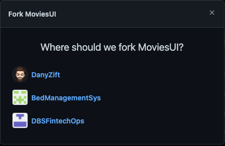
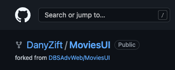
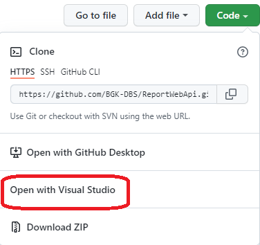
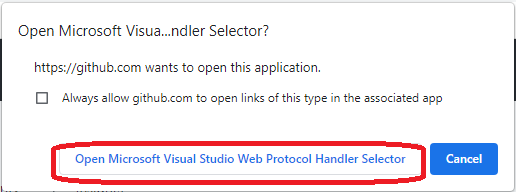

# Comments Web API

## Description: 
RapidNews Comments Web API provides CRUD actions for comments related to news reports:  
* Get a single comment
* Get a list of all comments
* Get a list of comments filtered by all/logged in user and reportID 
* Add a new comment
* Update an existing comment
* Delete a comment

It uses MSSQL creating a local comments db called Comments

This webapi is part of the NewsMedia application which can be found on GitHub - https://github.com/BGK-DBS/rapidNews


This document was created with the help of https://www.markdownguide.org/cheat-sheet

## Requirements 

* .NET version 6
* Visual Studio (Preferred) or Visual Studio Code
* Markdown editor plugin

## Download the CodeBase

Fork the project to your own Git Account. The fork button is on the top right of the MoviesUI repo:


A popup will appear asking you where you want to fork to - in my view its my personal account - DanyZift. Pick your own as it will be different on your view:



After clicking on your account it should then redirect to the forked repo. You should then see the following in the top right of the screen:(again your account name will show)



To open the solution in Visual Studio, select the Green Code button and then click on the "open with Visual Studio"


A box will appear asking can Github open in visual studio- continue by selecting this:



In visual studio, select clone at the bottom right hand corner of the screen

In solutions explorer, select CommentServiceAPI.sln

## Migrations 

### Creating Migration Scripts

* In Visual Studio, Click on the Tools -> Nuget Package Manager -> Package Manager Console
* First migration run the following

```bash
Add-Migration InitialCommentsMigration
```

* Verify migrations scripts are run successfully and Migrations folder is created

### Running Migrations Scripts

To run the migration, again open up the Package Manager Console and run the following:

```bash
Update-Database
```

## Running the project locally

Using Visual Studio: 
* Click the IIS express run button in visual studio
* When the solution is running, the Swagger UI can be accessed on  https://localhost:7202/swagger/index.html


## Future Enhancements
* To be Decided


 


